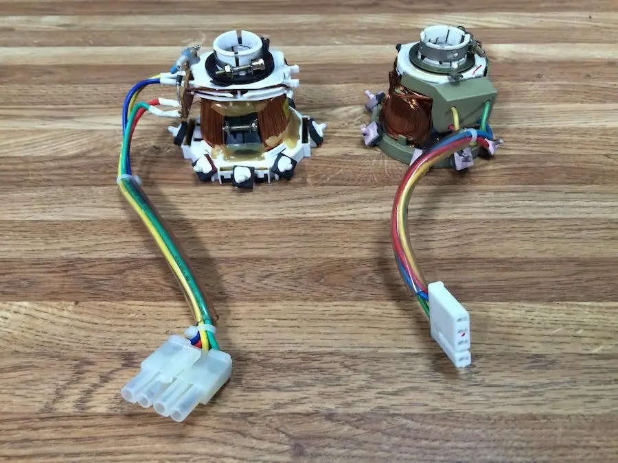

# Macintosh Classic (II) Analogboard recreation

This is a tested and working analog board recreation of the Macintosh Classic II analog board (820-0525-A). The provided files are licensed under CC-BY-NC-SA - they are NOT intended for commercial use

## General

This is a 1-1 reproduction of the Classic II analog board 820-0525-A / 630-0525, "late" revision.

## Yoke types

Somewhere during the development of the Classic II Apple changed the CRT yoke type. There are two different yokes which were used during that time, and they are not interchangeable. This replica is using the **B-TYPE** yoke, which is the right one in this photo.  Though It may be possible to interchange the entire yoke on the CRT, but i have not test this.

.

## Board

This board can be produced with 1.6MM thickness. 
ENIG Surface finish is advised due to slot copper peeling on HASL finish.

## 240V/110V

The board is capable of handling 110V and 240V. If you want to modify a Mac Classic from 110v to 240v (or vice versa) use
these tables. 
**Please note that I did not test the 110V setup*

| Ref  | 110V       | 240V       |
| ---- | ---------- | ---------- |
| JP1  | Jumperwire | -          |
| JP2  | -          | Jumperwire |
| CP1  | 220uF/250V | 220uF/400V |
| CP13 | 220uF/250V | -          |
| CP19 | 4.7nF/250V | 10nF/250V  |
| CP38 | Jumperwire | 10nF/250V  |

## BOM

This is a BOM for the 820-0525-A / 630-0525, "late" revision board. 
*Although I have done my utmost to ensure an accurate list, I cannot rule out that there are errors in the BOM. Use at your own risk*

| Ref  | Part/Value                 | Comment                       |
| ---- | -------------------------- | ----------------------------- |
| BD1  | Phoenix 1933215            |                               |
| BP1  | 250V Euro connector        |                               |
| BP2  | MOLEX 39281043             |                               |
| BP3  | KF2510 2P                  |                               |
| CF1  | 47uF/25V                   | UVZ1E470MDD1TA                |
| CF2  | 220uF/16V                  | URS1C221MPD1TA                |
| CF3  | 1000uF/16                  | UVR1E102MPD                   |
| CF4  | 470uF/25V                  | UVZ1E471MPD                   |
| CF5  | 220nF 63V MKT  (5%)        |                               |
| CF6  | 100nF 63V MKT (5%)         |                               |
| CF7  | 180nF 63V MKT  (5%)        |                               |
| CF8  | 330pF (331)                |                               |
| CL1  | 1000uF/25V                 | UVR1E102MPD                   |
| CL2  | 4.7uF/250V                 | UPS2E4R7MPD1TD                |
| CL3  | 1uF/50V                    | UVZ1H010MDD1TA                |
| CL5  | 0.01uF/2KV (103Z)          |                               |
| CL6  | 0.028uF 400V               |                               |
| CL7  | 0.1uF 5% 100V MKT          |                               |
| CL8  | 0.0022uF (222J)            |                               |
| CL9  | 470pF (471)                |                               |
| CL10 | 1.4uF placed               | 3.9uF  on schematic           |
| CL11 | 47uF/16V                   | UVZ1E470MDD1TA                |
| CP1  | 220uF/250V                 | UVZ2E221MRD                   |
| CP2  | 470uF/50V                  | UPW1H471MHD                   |
| CP3  | 10uF/25V                   | UVZ1E100MDD1TA                |
| CP4  | 47uF/25V                   | UVZ1E470MDD1TA                |
| CP5  | 1uF/50V                    | UVZ1H010MDD1TA                |
| CP6  | 2200uF/10V                 | UVZ1C222MHD                   |
| CP7  | 1000uF/10V                 | UVR1E102MPD                   |
| CP8  | 2200uF/16V                 | UVZ1C222MHD                   |
| CP9  | 470uF/25V                  | UVZ1E471MPD                   |
| CP10 | 470uF/25V                  | UVZ1E471MPD                   |
| CP11 | 220uF/50V                  | UHE1H221MPD                   |
| CP12 | 1000uF/16v                 | UVR1E102MPD                   |
| CP13 | 0 Ohm  jumperwire          |                               |
| CP15 | 0.0047uF                   | Axial 4n7 F160 Philips        |
| CP16 | 0.22UF 250V  (XE224)       |                               |
| CP17 | 0.22uF MKT 63V (5%)        |                               |
| CP18 | 0.033uF 630V 3%            |                               |
| CP19 | 10nF 250V                  |                               |
| CP20 | 0.001uF (102)              |                               |
| CP21 | 0.0018uF                   |                               |
| CP22 | 3.3nF                      |                               |
| CP23 | 270pF/2KV (271J)           |                               |
| CP24 | 0.1uF 5% 100V  MKT         |                               |
| CP25 | 0.22uF 63V MKT             |                               |
| CP26 | 0.22uF (223Z)              |                               |
| CP27 | 0.22uF 63V MKT             |                               |
| CP28 | 0.1uF 5% 100V  MKT (XE104) |                               |
| CP29 | 0.0033uF (3300nF) 250V     |                               |
| CP30 | 0.0033uF  (3300nF) 250V    |                               |
| CP34 | 1uF/50V                    | UVZ1H010MDD1TA                |
| CP36 | 2200uF/10V                 | UVZ1C222MHD                   |
| CP37 | 1uF/50V                    | UVZ1H010MDD1TA                |
| CP38 | 10nF 250V                  |                               |
| CP39 | 470pF/1KV                  |                               |
| CP40 | 0.022 (223Z)               |                               |
| CV1  | 47pF                       |                               |
| CV2  | 470uF/10V                  | UPJ1A471MPD6                  |
| DF1  | 1N4001                     |                               |
| DF2  | 1N4148                     |                               |
| DL1  | 1N4937                     |                               |
| DL3  | 2x RGP02-12 in  serie      |                               |
| DL4  | BYT01-300                  |                               |
| DL5  | BYV26B 400V                |                               |
| DL7  | 1N4148                     |                               |
| DL8  | 1N4148                     |                               |
| DL9  | 1N4148                     |                               |
| DL10 | 1N4001                     |                               |
| DL11 | 1N4148                     |                               |
| DP2  | BYW76                      |                               |
| DP3  | 1N4148                     |                               |
| DP4  | 1N4148                     |                               |
| DP5  | BYT03-300                  |                               |
| DP6  | MR1045                     | Coolrib  8022BG-ND            |
| DP7  | EGP30D                     |                               |
| DP8  | BY73D                      |                               |
| DP9  | AC                         |                               |
| DP11 | B5V6PH                     | BZX79B5V6                     |
| DP12 | BYD34J                     |                               |
| DP13 | 1N4002                     |                               |
| DP14 | LM431                      |                               |
| DV1  | PHB4V7                     |                               |
| FP1  | Fuse clips                 | 01000020Z / T3.15A            |
| IF1  | TEA2037                    |                               |
| IP1  | TDA4605                    |                               |
| IP2  | LM317T                     |                               |
| IP3  | 79L12                      |                               |
| J1   | Jumperwire                 |                               |
| J2   | Jumperwire                 |                               |
| J3   | Jumperwire                 |                               |
| J4   | Jumperwire                 |                               |
| J5   | Jumperwire                 |                               |
| J6   | Jumperwire                 |                               |
| J7   | Jumperwire                 |                               |
| J8   | Jumperwire                 |                               |
| J9   | Jumperwire                 |                               |
| J10  | Jumperwire                 |                               |
| J11  | Jumperwire                 |                               |
| J12  | Jumperwire                 |                               |
| J13  | Jumperwire                 |                               |
| J14  | Jumperwire                 |                               |
| J15  | Jumperwire                 |                               |
| JP1  |                            | 110V Only                     |
| LL1  | Apple custom coil          |                               |
| LP2  | Apple custom coil          |                               |
| LP3  | ELF656V                    | 27.0mH  1A                    |
| LP4  | Apple custom coil          |                               |
| LP5  | Apple custom coil          |                               |
| LP7  | 100UH                      |                               |
| PF1  | 100 /  PT10LH01-101        | Vertical Size potentiometer   |
| PF2  | 2K2 / PT10LH01-222A        | Vertical Centering adjustment |
| PL1  | 2M2                        | Focus adjustment              |
| PL2  | 2M2                        | Cut-Off adjustment            |
| PL3  | 2K7 /  PT10LH01-272A       | H.  Center adjustment         |
| PL4  | 68K / 	PT10MH02-683A    | Brightness range adjustment   |
| PP1  | 220 /  PT10LV10-221A       | Voltage adjustment            |
| PP2  | 2K2 / PT10LH01-222A        | Size adjustment               |
| QL1  | BF421                      |                               |
| QL2  | IRF740                     |                               |
| QL3  | BC548B                     |                               |
| QL4  | BC548B                     |                               |
| QL5  | BF420                      |                               |
| QL6  | BC558                      |                               |
| QP1  | CNY17                      |                               |
| QP2  | IRF-BC40                   |                               |
| QP3  | BC548B                     |                               |
| QP5  | BC558B                     |                               |
| QP6  | BC547B                     |                               |
| QV1  | BC558                      |                               |
| RF1  | 820K 1/6W                  | Resistor  Carbon              |
| RF2  | 2K 1W                      | Resistor Metalfilm            |
| RF3  | 1K 1/6W                    | Resistor  Carbon              |
| RF4  | 330K 1/6W                  | Resistor Carbon               |
| RF5  | 470K 1/6W                  | Resistor  Carbon              |
| RF6  | 1.8 1/4W                   | Resistor Carbon               |
| RF7  | 3.3 1/4W                   | Resistor  Carbon              |
| RF8  | 82K 1/6W                   | Resistor Carbon               |
| RF9  | 330 1/6W                   | Resistor  Carbon              |
| RF10 | 560 1/6W                   | Resistor Carbon               |
| RF11 | 5.6K 1/4W                  | Resistor  Carbon              |
| RF12 | 270 1/4W                   | Resistor Carbon               |
| RF13 | 0.47 1/6W                  | Resistor  Carbon              |
| RL1  | 220 1/4W                   | Resistor Carbon               |
| RL2  | 1 1/6W                     | Resistor  Carbon              |
| RL4  | 360K 1/6W                  | Resistor Carbon               |
| RL5  | 4.7K 1/6W                  | Resistor  Carbon              |
| RL6  | 1K 1/6W                    | Resistor Carbon               |
| RL7  | 1K 1/6W                    | Resistor  Carbon              |
| RL8  | 470 1/6W                   | Resistor Carbon               |
| RL10 | 22 1/6W                    | Resistor  Carbon              |
| RL11 | 1M 1W                      | Resistor Metalfilm            |
| RL12 | 470K 1W                    | Resistor  Metalfilm           |
| RL13 | 1.5M 1W                    | Resistor Metalfilm            |
| RL14 | 3.3M 1W                    | Resistor  Metalfilm           |
| RL15 | 150K 1W                    | Resistor Metalfilm            |
| RL16 | 43K 1/6W                   | Resistor  Carbon              |
| RL18 | 820 1/6W                   | Resistor Carbon               |
| RL19 | 68K 1/6W                   | Resistor  Carbon              |
| RL20 | 22 1/6W                    | Resistor Carbon               |
| RL23 | 2.2K 1/6W                  | Resistor  Carbon              |
| RL24 | 1.8K 1/6W                  | Resistor Carbon               |
| RL25 | 100K 1/6W                  | Resistor  Carbon              |
| RL26 | 4.7K 1/6W                  | Resistor Carbon               |
| RL27 | 68 1/4W                    | Resistor  Metalfilm           |
| RL28 | Jumperwire                 |                               |
| RL29 | 330 1/6W                   | Resistor  Carbon              |
| RP1  | 22K 3W                     | Resistor Metalfilm            |
| RP2  | 20 COLD NTC                | NTC  Resistor                 |
| RP3  | 6.8K 1/6W                  | Resistor Carbon               |
| RP4  | 200 1/6W                   | Resistor  Carbon              |
| RP5  | 100 1/4W                   | Resistor Carbon               |
| RP6  | 4.7K 1/6W                  | Resistor  Carbon              |
| RP7  | 10K 1/6W                   | Resistor Carbon               |
| RP8  | 5.1K 1/6W                  | Resistor  Carbon              |
| RP9  | 220 1/6W                   | Resistor Carbon               |
| RP10 | 10K 1/6W                   | Resistor  Carbon              |
| RP13 | 1M 1W                      | Resistor Metalfilm            |
| RP14 | 220K 3W                    | Resistor  Metalfilm           |
| RP15 | 7.5K 3W                    | Resistor Metalfilm            |
| RP17 | 3.9K 1/6W                  | Resistor  Carbon              |
| RP18 | 480K 1W                    | Resistor Metalfilm            |
| RP23 | 470 1/6W                   | Resistor  Carbon              |
| RP24 | 560 1/6W                   | Resistor Carbon               |
| RP27 | 20K 1/6W                   | Resistor  Carbon              |
| RP28 | 47 1/6W                    | Resistor Carbon               |
| RP30 | 7.5K 3W                    | Resistor  Metalfilm           |
| RP32 | 1K 1/4W                    | Resistor Metalfilm            |
| RP33 | 4.7K 1/4W                  | Resistor  Carbon              |
| RP34 | 1K 1/6W                    | Resistor Carbon               |
| RP35 | 100 1/6W                   | Resistor  Carbon              |
| RP36 | 220 1/6W                   | Resistor Carbon               |
| RP37 | 2K 1/6W                    | Resistor  Carbon              |
| RP38 | 100 1/6W                   | Resistor Carbon               |
| RP40 | 220 1/4W                   | Resistor  Carbon              |
| RP41 | 2K 1/6W                    | Resistor Carbon               |
| RP42 | 10K 1/6W                   | Resistor  Carbon              |
| RP43 | 30K 1/6W                   | Resistor Carbon               |
| RP44 | 22K 1/4W                   | Resistor  Carbon              |
| RP46 | 470K 1W                    | Resistor Metalfilm            |
| RP47 | 10 1/4W                    | Resistor  Carbon              |
| RP48 | 47 1/6W                    | Resistor Carbon               |
| RV1  | 220 1/6W                   | Resistor  Carbon              |
| RV2  | 330 1/6W                   | Resistor Carbon               |
| RV3  | 220 1/6W                   | Resistor  Carbon              |
| RV4  | 330 1/4W                   | Resistor Carbon               |
| SS1  | 57MM Speaker               | 63Ohm speaker                 |
| ZL1  | 157-0129                   | Flyback transformer           |
| ZP1  | 157-0130                   | Transformer                   |

## Schematic

See "schematic" directory for the corresponding schematics.

## License

The provided files are licensed under CC-BY-NC-SA - they are NOT intended for commercial use.

## Disclaimer

This project involves potentially lethal High-Voltage. Construction and operation of this circuit should only be performed by people familiar with best practices when operating with high voltage, and using extreme caution.
I will not be held liable for injury or even death resulting from this part. Build and use this part only at your own risk.